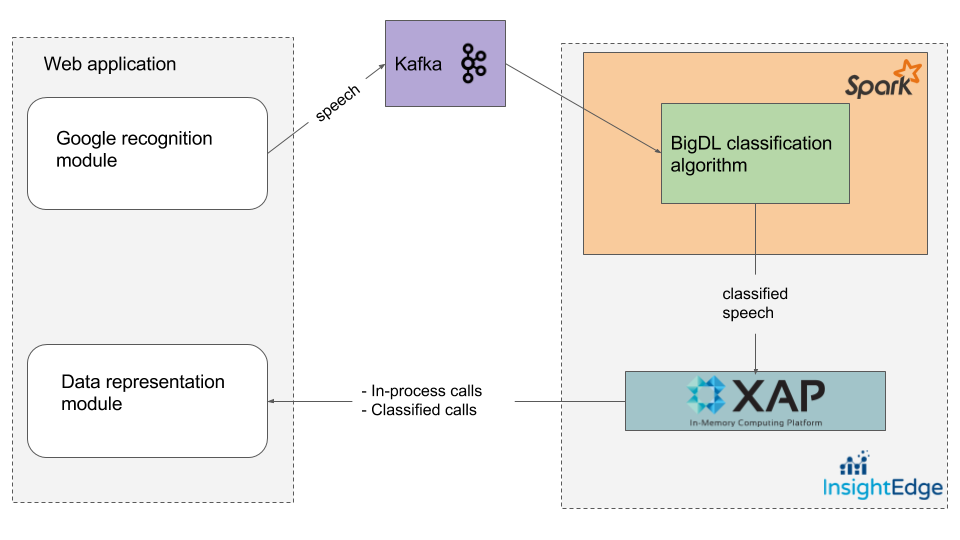

In this demo/blog post we will show you how to combine real-time speech recognition with real-time speech classification based on Intel's BigDL library and Insightedge.

## Motivation
Big companies with huge client base requires to organize call centers. In order to service client correctly it's vital to which specialist he should be directed. Current demo takes advantage of cutting edge technologies to resolve such tasks in effective and ...(in short time like 100 of milliseconds) manner.
Here is how it achieved in this demo:


## Architecture
Let's take a helicopter view of the application components.




### How to run

Used software:
* scala v2.10.4
* java 1.8.x
* kafka v0.8.2.2
* insightedge v1.0.0
* BigDL v0.2.0
* sbt v0.13.16
* maven v3.x

Prerequisites:
* Download and extract data(first three steps) as described [here](https://github.com/intel-analytics/BigDL/tree/master/spark/dl/src/main/scala/com/intel/analytics/bigdl/example/textclassification)
* Set INSIGHTEDGE_HOME and KAFKA_HOME env variables
* Make sure you have Scala installed: ```scala -version```

Steps:
* Change variables according to your needs in runModelTrainingJob.sh, runTextPredictionJob.sh, runKafkaProducer.sh 
* Build the project: ```sh build.sh```
* Start zookeeper and kafka server: ```sh kafka-start.sh```
* Create Kafka topic: ```sh kafka-create-topic.sh```. To verify that topic was created run ```sh kafka-topics.sh```
* Start Insightedge in demo mode: ```sh ie-demo.sh```
* Train text classifier model: ```sh runModelTrainingJob.sh```
* In separate terminal tab start kafka producer: ```sh runKafkaProducer.sh```. To verify that producer is sending messages you can run consumer which prints messages in the console: ```sh kafka-cosumer.sh```
* Deploy processor-0.2.0-jar-with-dependencies.jar in GS UI.
* In separate terminal tab start Spark streaming for predictions: ```sh runTextPredictionJob.sh```.
* Open GS UI and verify that predictions are saved in io.insightedge.bigdl.model.Prediction object.
* Start web server to track CallSessions objects: ```cd web and sh runWeb.sh```. Go to localhost:9000

Shutting down:
* Stop kafka: ```sh kafka-stop.sh```
* Stop Insightedge: ```sh ie-shutdown.sh```
