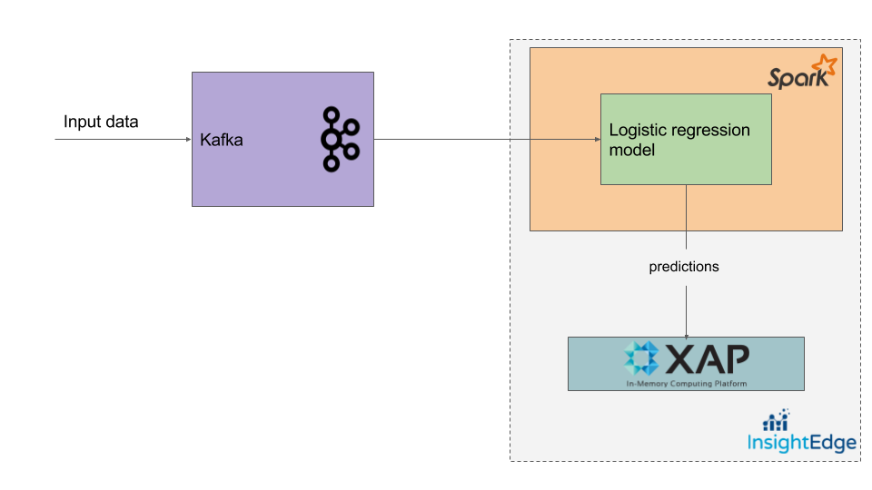

## Intro

Few words about what????

For showing what could be done we will slightly modify [Leo's example](http://technobium.com/logistic-regression-using-apache-spark/) about logistic regression for prediction company's bankruptcy.
In his example he uses only three possible values, 'P', 'N' and 'A' for attributes.
In our demo we will use percent numbers from 0 to 100 for attributes,  i.e. input data for our app will be set of probabilities for next attributes: 

    Industrial Risk
    Management Risk
    Financial Flexibility
    Credibility
    Competitiveness
    Operating Risk


## About logistic regression
[Logistic regression](https://spark.apache.org/docs/2.2.0/mllib-linear-methods.html#logistic-regression) is widely used to predict a binary response, in our case it's either bankruptcy or non-bankruptcy outcome.
As input features we are taking attributes percent values from 0 to 100 which reflect current company state.
Depending on these values our app is going to return a prediction about company's future.  

## Architecture and workflow
Let's see how it could be achieved with IE in combination with Kafka and Spark ML library.
Below you can see simplified architecture of the application:


Bankruptcy prediction is done in one Spark job, it's logically divided on two main parts: Model training and Prediction.
Model training part is for training model with [data](https://archive.ics.uci.edu/ml/datasets/Qualitative_Bankruptcy) we already have.
In prediction part [direct stream](http://spark.apache.org/docs/2.1.0/streaming-kafka-0-8-integration.html#approach-2-direct-approach-no-receivers) is created to get data from Kafka.
After data is read it's processed by trained model and prediction are done. Training model summary, prediction results alongside with input data are saved to the grid for later usage, you can use GS UI or WEBUI to check it.
To push data to Kafka we will use simple Java app which writes random probabilities to the Kafka's topic. 

## How to run the demo

1. Build project with `sh build.sh`
2. Run Insightedge in demo mode `sh is-demo.sh`
3. Start Kafka `sh kafka-start.sh`
4. Create Kafka topic `sh kafka-create-topic-bank.sh`
7. Start Spark job `sh runLogisticRegressionJob.sh`. Wait till you see "Waiting for input..." printed in the console.
6. In separate window/tab start Kafka producer `sh runKafkaProducerBank.sh`

Now prediction are done at real time and you should be able to see similar output in Spark job console:

```text
Input data 
    Industrial Risk: 24%
    Management Risk: 11%
    Financial Flexibility: 40%
    Credibility: 50%
    Competitiveness: 73%
    Operating Risk: 48%
Prediction: 1.0 (Non-bankruptcy)
Probabilities: Bankruptcy - 29% , Non-bankruptcy - 71%
```

The `Input data` is a data which was received from Kafka.
`Prediction` is a what trained model predicted - either bankruptcy or not.
`Probabilities` shows us probabilities for bankruptcy and non-bankruptcy event.

## What's next?
